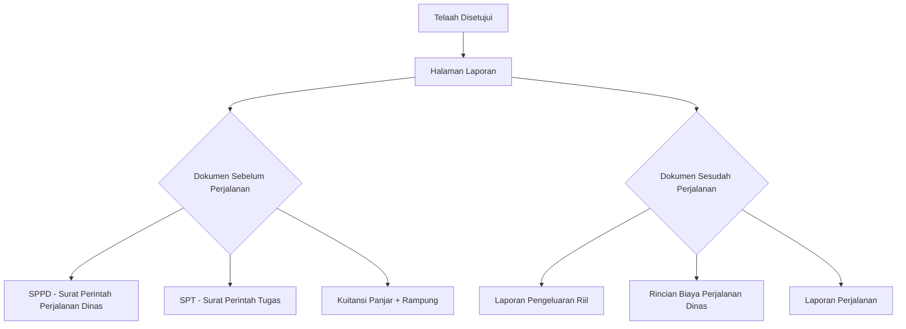
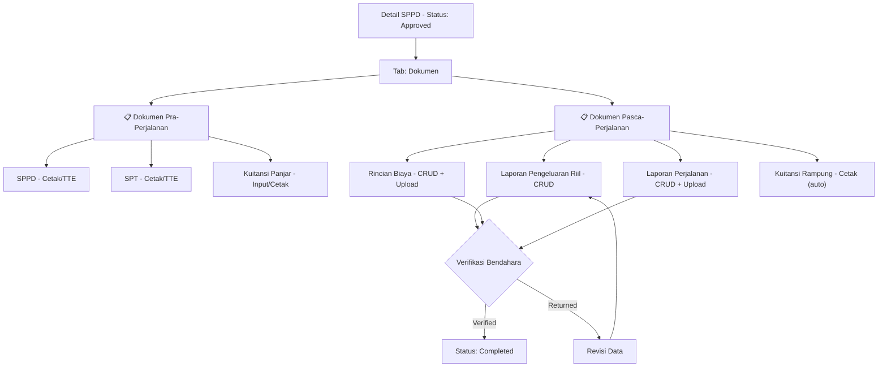

# PRD: Dokumen Pasca-Persetujuan Telaah SPPD

> **Versi**: 1.0  
> **Tanggal**: 19 Mei 2026  
> **Sistem Lama**: CodeIgniter 3 (sppd-2026)  
> **Sistem Baru**: Laravel 11 (sppd-update)

---

## 1. Ringkasan Eksekutif

Dokumen ini mendefinisikan spesifikasi untuk **5 fitur dokumen** yang diakses setelah telaah SPPD disetujui (status `approved`). Fitur-fitur ini merupakan bagian pertanggungjawaban keuangan perjalanan dinas.

---

## 2. Alur Sistem Lama (CI3) — Analisis

### 2.1 Alur Umum Setelah Telaah Disetujui



### 2.2 Detail Alur Per Fitur

#### A. Kuitansi Panjar (`table_kuitansi_panjar`)

**Alur di sistem lama:**

1. User membuka halaman **Laporan** dari telaah yang sudah disetujui
2. Sistem menampilkan daftar **Pelaksana** dan **Pengikut** perjalanan
3. Untuk setiap orang (pelaksana + pengikut), user bisa:
   - **Input Kuitansi Panjar** — jika belum ada data kuitansi
   - **Edit Kuitansi Panjar** — jika sudah ada data
   - **Cetak Kuitansi Panjar** — generate PDF kuitansi
4. Data yang diinput: `telaah_id`, `pegawai_id`, `jumlah` (nominal panjar)
5. Sistem membedakan query berdasarkan `telaah_kategori`:
   - Kategori 3 (DPRD) → join ke `table_anggotadprd`
   - Kategori 8 (Walikota) → join ke `table_pimpinan`
   - Lainnya → join ke `table_pegawai`

**Tabel**: `table_kuitansi_panjar`  
**Field**: `kuitansi_panjar_id`, `telaah_id`, `pegawai_id`, `jumlah`

#### B. Kuitansi Rampung (Computed/Cetak Only)

**Alur di sistem lama:**

1. Kuitansi Rampung **tidak memiliki tabel sendiri** — ini adalah dokumen cetak
2. Tombol "Cetak Kuitansi Rampung" hanya aktif jika:
   - Data **Pengeluaran Riil** sudah ada, **ATAU**
   - Data **Rincian Biaya** sudah ada
3. Jika keduanya kosong → tombol disabled (btn-default)
4. Kuitansi Rampung menghitung: `Panjar - Total Pengeluaran Riil = Sisa/Kurang`
5. Membutuhkan data **Bendahara Pengeluaran** yang valid

> [!IMPORTANT]
> Kuitansi Rampung adalah **dokumen turunan** yang mengkonsolidasikan data dari Kuitansi Panjar, Pengeluaran Riil, dan Rincian Biaya. Bukan entitas tersendiri.

#### C. Laporan Pengeluaran Riil (`table_pengeluaran_rill`)

**Alur di sistem lama:**

1. Diakses dari halaman Laporan → "Dokumen Sesudah Perjalanan"
2. Menampilkan daftar pengeluaran per pelaksana dan per pengikut
3. User dapat **Tambah**, **Edit**, **Hapus** item pengeluaran
4. Setiap item berisi: `uraian` (deskripsi) dan `tarif` (nominal)
5. Data PPTK (penandatangan) diambil dari telaah berdasarkan role user
6. Total pengeluaran = `SUM(tarif)` per pegawai per telaah

**Tabel**: `table_pengeluaran_rill`  
**Field**: `pengeluaran_rill_id`, `telaah_id`, `pegawai_id`, `uraian`, `tarif`

#### D. Rincian Biaya Perjalanan Dinas (`table_rincian_biaya`)

**Alur di sistem lama:**

1. Diakses dari halaman Laporan → "Dokumen Sesudah Perjalanan"
2. Menampilkan rincian biaya per pelaksana dan per pengikut
3. Setiap item berisi:
   - `kategori_biaya` — jenis biaya (transportasi, akomodasi, dll)
   - `keterangan` — detail keterangan
   - `nama_maspakai` — nama maskapai (untuk tiket)
   - `no_tiket` — nomor tiket
   - `item` — jumlah/quantity
   - `tarif` — tarif satuan
   - `foto` — upload bukti/nota (gambar)
4. Total biaya = `SUM(tarif * item)` per pegawai
5. Mendukung upload file bukti (gif, jpg, jpeg, png, max 20MB)

**Tabel**: `table_rincian_biaya`  
**Field**: `rincian_biaya_id`, `telaah_id`, `pegawai_id`, `kategori_biaya`, `keterangan`, `nama_maspakai`, `no_tiket`, `item`, `tarif`, `foto`

#### E. Laporan Perjalanan (`table_laporanperjalanan`)

**Alur di sistem lama:**

1. Diakses dari halaman Laporan → "Dokumen Sesudah Perjalanan"
2. Menampilkan daftar laporan perjalanan dalam tabel
3. User dapat **Tambah**, **Edit**, **Hapus** laporan
4. Setiap laporan berisi:
   - `laporanperjalanan_desc` — keterangan/isi laporan
   - `laporanperjalanan_date` — tanggal
   - `laporanperjalanan_file` — upload file dokumen
5. Hanya user non-admin dan non-bendahara yang bisa menambah data
6. File diupload ke folder `upload/laporan_perjalanan/`

**Tabel**: `table_laporanperjalanan`  
**Field**: `laporanperjalanan_id`, `telaah_id`, `laporanperjalanan_desc`, `laporanperjalanan_date`, `laporanperjalanan_file`

---

## 3. Spesifikasi Sistem Baru (Laravel)

### 3.1 Data Model Mapping

| Fitur              | Tabel Lama                | Tabel Baru              | Model Laravel        |
| ------------------ | ------------------------- | ----------------------- | -------------------- |
| Kuitansi Panjar    | `table_kuitansi_panjar`   | `sppd_advance_receipts` | `SppdAdvanceReceipt` |
| Pengeluaran Riil   | `table_pengeluaran_rill`  | `sppd_actual_expenses`  | `SppdActualExpense`  |
| Rincian Biaya      | `table_rincian_biaya`     | `sppd_cost_details`     | `SppdCostDetail`     |
| Laporan Perjalanan | `table_laporanperjalanan` | `sppd_reports`          | `SppdReport`         |
| Kuitansi Rampung   | _(cetak only)_            | _(computed)_            | _(Service class)_    |

### 3.2 Schema Detail

#### `sppd_advance_receipts` (Kuitansi Panjar)

```php
Schema::create('sppd_advance_receipts', function (Blueprint $table) {
    $table->id();
    $table->foreignId('sppd_request_id')->constrained()->cascadeOnDelete();
    $table->foreignId('user_id')->constrained();
    $table->decimal('amount', 15, 2);             // jumlah panjar
    $table->string('receipt_number')->nullable();   // nomor kuitansi (auto-generate)
    $table->string('receipt_file')->nullable();     // file kuitansi PDF
    $table->timestamps();
});
```

#### `sppd_actual_expenses` (Pengeluaran Riil)

```php
Schema::create('sppd_actual_expenses', function (Blueprint $table) {
    $table->id();
    $table->foreignId('sppd_request_id')->constrained()->cascadeOnDelete();
    $table->foreignId('user_id')->constrained();
    $table->string('description');                  // uraian
    $table->decimal('amount', 15, 2);              // tarif/nominal
    $table->string('receipt_file')->nullable();     // file bukti
    $table->timestamps();
});
```

#### `sppd_cost_details` (Rincian Biaya)

```php
Schema::create('sppd_cost_details', function (Blueprint $table) {
    $table->id();
    $table->foreignId('sppd_request_id')->constrained()->cascadeOnDelete();
    $table->foreignId('user_id')->constrained();
    $table->string('cost_category');               // kategori_biaya
    $table->string('description');                 // keterangan
    $table->string('airline_name')->nullable();    // nama_maspakai
    $table->string('ticket_number')->nullable();   // no_tiket
    $table->decimal('unit_cost', 15, 2);          // tarif satuan
    $table->integer('quantity')->default(1);        // item/jumlah
    $table->decimal('total', 15, 2);              // computed: unit_cost * quantity
    $table->string('receipt_photo')->nullable();    // foto bukti
    $table->timestamps();
});
```

#### `sppd_reports` (Laporan Perjalanan)

```php
Schema::create('sppd_reports', function (Blueprint $table) {
    $table->id();
    $table->foreignId('sppd_request_id')->constrained()->cascadeOnDelete();
    $table->text('report_text');                    // isi laporan
    $table->date('report_date')->nullable();        // tanggal laporan
    $table->string('report_file')->nullable();      // file laporan
    $table->string('documentation_file')->nullable(); // foto dokumentasi
    $table->decimal('total_expense', 15, 2)->nullable();
    $table->string('verification_status')->default('pending'); // pending|verified|returned
    $table->foreignId('verified_by')->nullable()->constrained('users');
    $table->timestamp('verified_at')->nullable();
    $table->timestamps();
});
```

### 3.3 User Stories

#### US-1: Kuitansi Panjar

```
Sebagai Staff/Admin OPD,
Saya ingin menginput jumlah uang muka (panjar) untuk setiap pelaksana dan pengikut perjalanan,
Agar bukti pencairan dana awal dapat didokumentasikan dan dicetak.
```

**Acceptance Criteria:**

- [ ] Tombol "Input Kuitansi Panjar" muncul per-orang jika belum ada data
- [ ] Tombol berubah menjadi "Edit" jika data sudah ada
- [ ] Input berupa nominal (currency format Rp)
- [ ] Dapat mencetak PDF kuitansi panjar per orang
- [ ] Bendahara Pengeluaran harus tersedia untuk cetak

#### US-2: Kuitansi Rampung

```
Sebagai Staff/Admin OPD,
Saya ingin mencetak kuitansi rampung yang menghitung selisih panjar vs pengeluaran riil,
Agar pertanggungjawaban keuangan perjalanan dapat diselesaikan.
```

**Acceptance Criteria:**

- [ ] Tombol cetak hanya aktif jika Pengeluaran Riil ATAU Rincian Biaya sudah diisi
- [ ] PDF menampilkan: Panjar, Total Pengeluaran, Selisih (sisa/kurang bayar)
- [ ] Terbilang otomatis (angka → huruf dalam Bahasa Indonesia)
- [ ] Memerlukan data Bendahara Pengeluaran

#### US-3: Laporan Pengeluaran Riil

```
Sebagai pelaksana perjalanan dinas,
Saya ingin mencatat setiap pengeluaran riil selama perjalanan,
Agar total biaya aktual terdokumentasi untuk pertanggungjawaban.
```

**Acceptance Criteria:**

- [ ] CRUD untuk item pengeluaran (uraian + nominal)
- [ ] Tampil per pelaksana dan per pengikut
- [ ] Auto-sum total pengeluaran per orang
- [ ] Data PPTK penandatangan tampil dari telaah
- [ ] Dapat dicetak sebagai PDF

#### US-4: Rincian Biaya Perjalanan Dinas

```
Sebagai pelaksana perjalanan dinas,
Saya ingin merinci setiap komponen biaya (transportasi, akomodasi, uang harian, dll),
Agar bukti penggunaan anggaran dapat dipertanggungjawabkan secara detail.
```

**Acceptance Criteria:**

- [ ] CRUD untuk item biaya dengan field: kategori, keterangan, qty, tarif
- [ ] Upload foto bukti/nota (max 20MB, format gambar)
- [ ] Kolom opsional: nama maskapai, nomor tiket
- [ ] Total per item = tarif × quantity (auto-compute)
- [ ] Grand total per orang
- [ ] Dapat dicetak sebagai PDF

#### US-5: Laporan Perjalanan

```
Sebagai pelaksana perjalanan dinas,
Saya ingin membuat laporan kegiatan perjalanan beserta dokumentasi,
Agar hasil perjalanan dinas terdokumentasi dan dapat diverifikasi.
```

**Acceptance Criteria:**

- [ ] CRUD untuk laporan (keterangan, tanggal, file upload)
- [ ] Upload file dokumen laporan
- [ ] Hanya pelaksana/pembuat yang bisa menambah (bukan admin/bendahara)
- [ ] Status verifikasi: pending → verified/returned oleh Bendahara
- [ ] Dapat dicetak sebagai PDF

---

### 3.4 API Endpoints (Laravel Routes)

```php
// Semua route di bawah middleware auth + prefix 'sppd/{sppdRequest}'

// Kuitansi Panjar
Route::resource('advance-receipts', SppdAdvanceReceiptController::class);
Route::get('advance-receipts/{receipt}/print', [SppdAdvanceReceiptController::class, 'print']);

// Kuitansi Rampung (cetak only)
Route::get('settlement-receipt/print/{userId}', [SettlementReceiptController::class, 'print']);

// Pengeluaran Riil
Route::resource('actual-expenses', SppdActualExpenseController::class);
Route::get('actual-expenses/print/{userId}', [SppdActualExpenseController::class, 'print']);

// Rincian Biaya
Route::resource('cost-details', SppdCostDetailController::class);
Route::get('cost-details/print/{userId}', [SppdCostDetailController::class, 'print']);

// Laporan Perjalanan
Route::resource('reports', SppdReportController::class);
Route::get('reports/{report}/print', [SppdReportController::class, 'print']);
Route::patch('reports/{report}/verify', [SppdReportController::class, 'verify']);
```

### 3.5 Business Rules

#### BR-1: Akses Fitur Dokumen

- Semua fitur ini **hanya tersedia** setelah status SPPD = `approved` atau `completed`
- Role `admin`, `staff`, `pptk` di OPD terkait dapat mengakses
- Bendahara hanya bisa **melihat dan memverifikasi**, tidak bisa menambah data

#### BR-2: Kuitansi Panjar

- Maksimal **1 kuitansi panjar per orang per SPPD**
- Jika sudah ada → mode edit, bukan insert baru
- Nomor kuitansi di-generate otomatis: `KP-{SKPD_CODE}-{YEAR}-{SEQ}`

#### BR-3: Kuitansi Rampung

- **Prerequisite**: Pengeluaran Riil ATAU Rincian Biaya harus terisi
- **Prerequisite**: Bendahara Pengeluaran harus terdaftar di OPD
- Kalkulasi: `Selisih = Total Panjar - Total Pengeluaran Riil`
- Jika selisih positif → "Sisa Lebih" (harus dikembalikan)
- Jika selisih negatif → "Kurang Bayar" (harus dibayar ke pegawai)

#### BR-4: Pengeluaran Riil

- Bisa **multiple items** per orang per SPPD
- Total = `SUM(amount)` per user per SPPD
- Data PPTK penandatangan diambil dari `sppd_requests.pptk_id`

#### BR-5: Rincian Biaya

- Bisa **multiple items** per orang per SPPD
- `total = unit_cost * quantity` (auto-computed di backend)
- Upload bukti opsional tapi direkomendasikan
- Kategori biaya: Transportasi, Akomodasi, Uang Harian, Uang Representasi, dll

#### BR-6: Laporan Perjalanan

- Bisa **multiple entries** per SPPD
- Verifikasi dilakukan oleh Bendahara/PPTK
- Status: `pending` → `verified` atau `returned`
- File upload disimpan di `storage/app/public/laporan_perjalanan/`

### 3.6 Perbaikan dari Sistem Lama

| Aspek          | Sistem Lama (CI3)                          | Sistem Baru (Laravel)                 |
| -------------- | ------------------------------------------ | ------------------------------------- |
| User Model     | 3 tabel terpisah (pegawai, pimpinan, dprd) | 1 tabel `users` unified               |
| Query Logic    | Switch-case per role (spaghetti)           | Polymorphic via `user_id` FK          |
| File Upload    | Manual CI upload library                   | Laravel Storage + Spatie MediaLibrary |
| PDF Generation | FPDF manual per-cell                       | DomPDF/Snappy dengan Blade template   |
| Validasi       | Minimal form_validation                    | Laravel Form Request + Policy         |
| Keamanan       | ID di-encrypt manual di URL                | Route Model Binding + Policy          |
| Audit Trail    | Manual log insert                          | Spatie Activity Log otomatis          |
| Verifikasi     | Tidak ada workflow                         | Status enum + verified_by tracking    |

### 3.7 Alur UI/UX Baru (Konseptual)



---

## 4. Prioritas Implementasi

| #   | Fitur                    | Prioritas     | Estimasi |
| --- | ------------------------ | ------------- | -------- |
| 1   | Rincian Biaya Perjalanan | P0 - Critical | 3-4 hari |
| 2   | Laporan Pengeluaran Riil | P0 - Critical | 2-3 hari |
| 3   | Kuitansi Panjar          | P0 - Critical | 2-3 hari |
| 4   | Kuitansi Rampung (Cetak) | P1 - High     | 2 hari   |
| 5   | Laporan Perjalanan       | P1 - High     | 2-3 hari |
| 6   | PDF Templates (semua)    | P1 - High     | 3-4 hari |
| 7   | Verifikasi Bendahara     | P2 - Medium   | 1-2 hari |

**Total estimasi: 15-21 hari kerja**

---

## 5. Open Questions

> [!IMPORTANT]
> **Q1**: Apakah Kuitansi Rampung tetap hanya dokumen cetak, atau perlu disimpan sebagai record di database (untuk tracking status selesai/belum)?

> [!IMPORTANT]  
> **Q2**: Apakah perlu fitur **upload bukti transfer** pada Kuitansi Rampung untuk membuktikan pengembalian sisa panjar?

> [!NOTE]
> **Q3**: Untuk Rincian Biaya, apakah kategori biaya (Transportasi, Akomodasi, dll) harus configurable dari admin, atau hardcode enum saja?

> [!NOTE]
> **Q4**: Apakah Laporan Perjalanan perlu fitur **rich text editor** untuk isi laporan, atau cukup textarea biasa + file upload?
